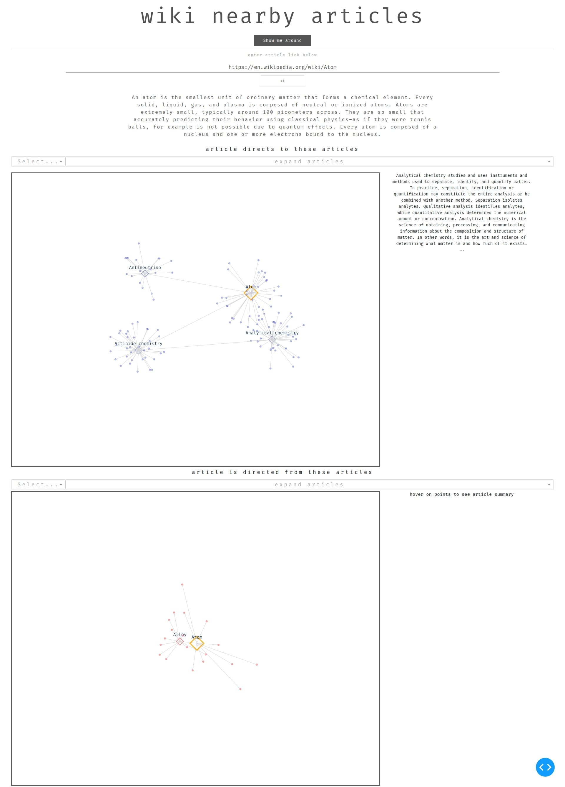

   

<!-- 

    

 -->

This is a dash app that visualises connections between Wikipedia articles. Visit the app here: 
https://wiki-nearby-articles.herokuapp.com

You can run the app locally by running the `run.py` file and installing the required dependencies. 

